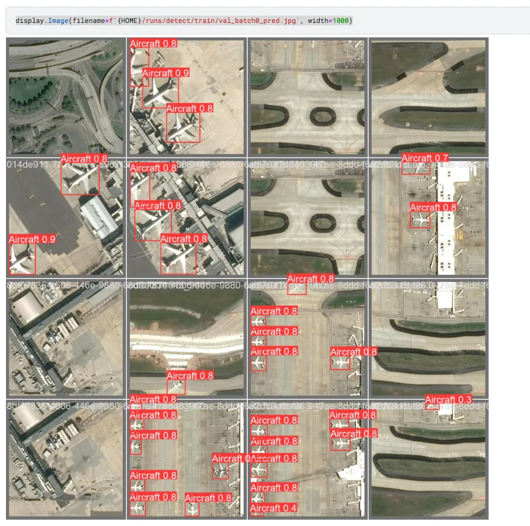
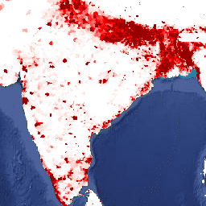
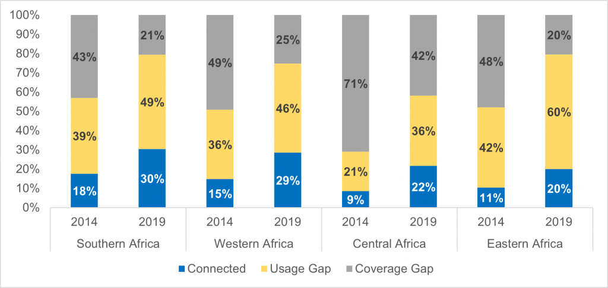

# Kwestie techniczne

## Wykrywanie skupisk ludzi

Za pomocą modelu YOLOv8. Jest on powszechnie używanym modelem podczas rozwiązywania problemów detekcji obiektów ze względu na wygodę użycia i dobrą dokładność.

Powyżej przykład zastosowania YOLO do detekcji samolotów na zdjęciach satelitarnych. Po przygotowaniu zbioru danych model można nauczyć rozpoznawania miejscowości.

### Estymacja liczebności poszczególnych zbiorów ludzi

Google Earth udostępnia źródła zagęszczenia ludności:
- [GPWv411](https://developers.google.com/earth-engine/datasets/catalog/CIESIN_GPWv411_GPW_Population_Density) 
- [LandScan](https://developers.google.com/earth-engine/datasets/catalog/projects_sat-io_open-datasets_ORNL_LANDSCAN_GLOBAL)

## Badanie odległości od najbliższej studni

Niektóre organizacje (takie jak Water For Good) udostępniają lokalizacje utrzymywanych przez siebie studni. Dla reszty krajów można znaleźć lokalizacje studni, korzystając ze zdjęć satelitarnych i modelu detekcji obiektów.

## Badanie dostępności dróg, sieci elektrycznej

Żródła takie jak [World Bank](https://datacatalog.worldbank.org/search/dataset/0040465/Africa---Electricity-Transmission-and-Distribution-Grid-Map) oraz [Komisja Europejska](https://africa-knowledge-platform.ec.europa.eu/explore_maps?title=OpenStreetMap%20African%20Roads) udostępniają informacje na temat dostępu sieci elektrycznej oraz dróg.

## Badanie stanu upraw

Jest już [gotowe rozwiązanie](https://github.com/OmdenaAI/cracow-poland-rural-farmers#improving-digital-advisory-services-for-rural-farmers-using-predictive-analytics-and-satellite-imagery), którym można się zainspirować lub uzgodnić warunki użytku z autorami.

## Badanie możliwego zasięgu telefonii komórkowej
[OpenCellID](https://opencellid.org/) to otwarta światowa baza danych anten telefonii komórkowej. Znajdują się tam takie dane jak położenie (latitude, longitude), teoretyczny zasięg oraz wykorzystywana technologia (2G, 3G, 4G).
[W Afryce tylko 70 % ludności ma dostęp do telefonii komórkowej](https://www.gsma.com/mobilefordevelopment/blog/mobile-connectivity-in-sub-saharan-africa-4g-and-3g-connections-overtake-2g-for-the-first-time/)
